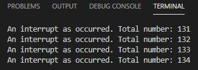

## Practica 2 Parte 2
***Raul Gonzalez / Sofia Valero***
## Codigo:

```
#include <Arduino.h>

volatile int interruptCounter;
int totalInterruptCounter;
hw_timer_t * timer = NULL;
portMUX_TYPE timerMux = portMUX_INITIALIZER_UNLOCKED;

void IRAM_ATTR onTimer() {
    portENTER_CRITICAL_ISR(&timerMux);
    interruptCounter++;
    portEXIT_CRITICAL_ISR(&timerMux);
}

void setup() {
    Serial.begin(115200);
    timer = timerBegin(0, 80, true);
    timerAttachInterrupt(timer, &onTimer, true);
    timerAlarmWrite(timer, 1000000, true);
    timerAlarmEnable(timer);
}

void loop() {
    if (interruptCounter > 0) {
    portENTER_CRITICAL(&timerMux);
    interruptCounter--;
    portEXIT_CRITICAL(&timerMux);
    totalInterruptCounter++;
    Serial.print("An interrupt as occurred. Total number: ");
    Serial.println(totalInterruptCounter);
    }
}
```
### Salida:
El codigo funciona muy parecido al codigo de la parte 1, pero en vez de realizar interrupciones cada vez que usamos un pulsador o desconectamos un cable, este genera interrupciones cada segundo, mostrando el mensaje por pantalla:***"An interrupt as occurred. Total number: "***.<br>




### Funcionamiento del Programa:
Lo primero que añadimos al programa es la libreria que vamos a necesitar, creamos las variables que necesitamos, entre ellas *volatile, totalinterruptcounter, hw_timer_t y portMUX_TYPE*.<br>
Luego creamos una funvion IRAM_ATTR que se encarga de sumar 1 al contador para cada interrupcion, en el loop famos las condiciones para que funcione como queremos y posteriormente nos enseñe por pantalla el mensaje que queremos con el contador de interrupciones realizadas.