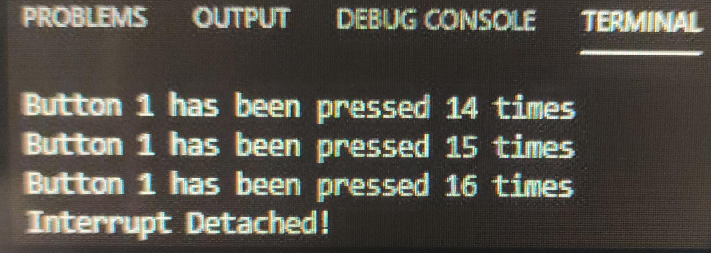

## Practica 2 Parte 1
***Raul Gonzalez / Sofia Valero***
## Codigo:

```
 #include <Arduino.h>

struct Button {
    const uint8_t PIN;
    uint32_t numberKeyPresses;
    bool pressed;
};
Button button1 = {18, 0, false};
    void IRAM_ATTR isr() {
    button1.numberKeyPresses += 1;
    button1.pressed = true;
}
void setup() {
    Serial.begin(115200);
    pinMode(button1.PIN, INPUT_PULLUP);
    attachInterrupt(button1.PIN, isr, FALLING);
}
void loop() {
    if (button1.pressed) {
    Serial.printf("Button 1 has been pressed %u times\n", button1.numberKeyPresses);
    button1.pressed = false;
}
//Detach Interrupt after 1 Minute
static uint32_t lastMillis = 0;
if (millis() - lastMillis > 60000) {
    lastMillis = millis();
    detachInterrupt(button1.PIN);
    Serial.println("Interrupt Detached!");
    }
}
```
### Salida:
Tras compilar correctamente el codigo y subirlo a la placa, veremos un texto el cual nos notifica cuantas veces hemos pulsado el boton o en nuestro caso, conectado y desconectado el cable, nosotros lo hemos realizado conectando un cable desde el pin "18" a *gnd*. Al no ser un pulsador como tal y tener una frecuencia de deteccion muy alta, el contador es muy impreciso.<br>
*En la imagen vemos como funciona el contador*<br><br>



### Funcionamiento del Programa:
Lo primero que realizamos es declarar la libreria que usaremos en el programa. Posteriormente creamos el struct que nos permite asignar un pin a la salida del pulsador, o en nuestro caso un cable.
Este cable al desconectarse hara la funcion de crear interrupciones. <br>
El loop del programa se va a encargar de mostrarnos por pantalla la cantidad de veces que se ha interrumpido un proceso, con un mensaje que dice:***"Button 1 has been pressed %u times\n"***, donde *%u* es la cantidad de veces que el cable se ha desconectado.<br>

Finalmente si el boton no se ha pulsado durante mas de 1 minuto, se mostrara el mensaje de "Interrupt Detached!".